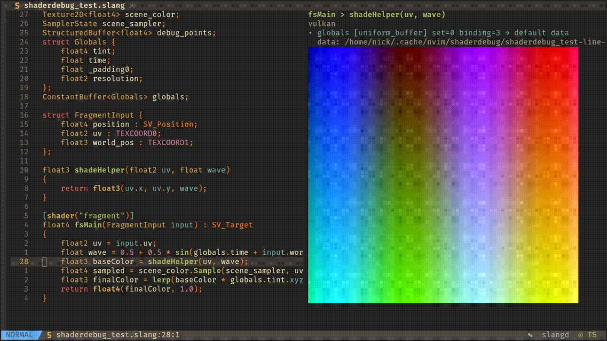

# shaderdebug

A Neovim plugin for live Slang shader debugging — preview what any line of your fragment shader outputs, right in the editor.



## What it does

- **Live shader previews** — move your cursor to any Slang line and see what it outputs rendered on a quad
- **Reflection-driven** — automatically detects textures, buffers, samplers, and uniform bindings from your shader
- **Interactive inputs** — click or press Enter on any input to bind custom images, textures, or JSON data
- **Dual render API** — render previews through Vulkan or headless OpenGL/EGL
- **Selectable preview display backend** — show images through Neovim's native `vim.ui.img` API or `image.nvim`
- **Non-blocking** — everything runs in the background, so your editor never stutters

## Installation

### Using lazy.nvim

With `image.nvim`:

```lua
{
  "NickTsaizer/shaderdebug.nvim",
  ft = { "slang" },
  dependencies = { "3rd/image.nvim" },
}
```

With Neovim's native image support only:

```lua
{
  "NickTsaizer/shaderdebug.nvim",
  ft = { "slang" },
}
```

### Requirements

- **Neovim** 0.10+
- **Preview display backend** — either:
  - **A Neovim build with native image support** (`vim.ui.img`)
  - **image.nvim** for plugin-based inline image rendering
- **slangc** — available on your `PATH`, or configured via `setup({ slangc = "/path/to/slangc" })`
- **glslangValidator** — available on your `PATH`, or configured via `setup({ glslang_validator = "/path/to/glslangValidator" })`
- **Vulkan** — required when `api = "vulkan"` or `api = "auto"`
- **EGL + OpenGL** — required when `api = "opengl"` (headless/offscreen path)
- **libepoxy** — OpenGL function loading for the headless EGL path
- **ffmpeg** — for non-PNG image conversion
- **libpng** — PNG reading/writing

## Quick Start

```vim
" Open a Slang shader file
:e myshader.slang

" Preview the current line
:ShaderDebugPreview

" Enable auto-preview on cursor move
:ShaderDebugToggleAuto
```

Configure the render API and preview display backend in `setup()`:

```lua
require("shaderdebug").setup({
  api = "auto", -- "vulkan", "opengl", or "auto"
  preview = {
    backend = "native", -- "native", "auto", or "image.nvim"
  },
})
```

## Usage

### Commands

| Command | Description |
|---------|-------------|
| `:ShaderDebugPreview` | Render preview for the current line |
| `:ShaderDebugToggleAuto` | Toggle live preview on cursor move |
| `:ShaderDebugInputs` | Show reflected inputs in the message area |
| `:ShaderDebugSetImage <name> <path>` | Bind a single image to an input |
| `:ShaderDebugSetImages <name> <paths>` | Bind multiple images (comma-separated) |
| `:ShaderDebugSetData <name> <json>` | Bind JSON data to a buffer input |
| `:ShaderDebugClearInput <name>` | Clear an input override |
| `:ShaderDebugClear` | Close the preview and disable auto-preview |

### Interactive Preview

The preview split shows:

1. **Header** — `<entry> > <expression>`
2. **Render API** — the active renderer (e.g. `vulkan`)
3. **Inputs** — each reflected resource with current binding

Move the cursor onto an input line and press:

- **Enter** — edit that input (prompt for image path, JSON data, etc.)
- **x** — clear the input override
- **r** — refresh the preview

## Configuration

Pass options to `setup()`:

```lua
require("shaderdebug").setup({
  api = "vulkan",            -- "vulkan", "opengl", or "auto"
  auto_preview = false,      -- start with auto-preview disabled
  debounce_ms = 180,         -- delay before rendering
  image_size = 512,          -- preview image resolution
  slangc = "slangc",         -- compiler command or absolute path
  glslang_validator = "glslangValidator", -- validator command or absolute path
  preview = {
    backend = "native",      -- "native", "auto", or "image.nvim"
    cell_aspect_ratio = nil,  -- override terminal cell height/width ratio if needed
  },
})
```

### Render API notes

- `api = "vulkan"` compiles Slang to SPIR-V and uses the Vulkan offscreen renderer
- `api = "opengl"` compiles Slang to GLSL and uses a headless EGL/OpenGL renderer
- `api = "auto"` currently resolves to Vulkan

### Preview display backend notes

- `preview.backend = "native"` is the default and requires a Neovim build with `vim.ui.img` support
- `preview.backend = "auto"` prefers Neovim's native image API when supported, then falls back to `image.nvim`
- `preview.backend = "image.nvim"` forces plugin-based preview rendering
- `preview.cell_aspect_ratio` lets you manually tune image sizing when your terminal reports unusual cell proportions

Example native-only setup:

```lua
require("shaderdebug").setup({
  preview = {
    backend = "native",
  },
})
```

Example `image.nvim` setup with manual sizing override:

```lua
require("shaderdebug").setup({
  preview = {
    backend = "image.nvim",
    cell_aspect_ratio = 2,
  },
})
```

### OpenGL texture example

```slang
Texture2D<float4> albedo;
SamplerState albedoSampler;

struct FragmentInput
{
    float2 uv: TEXCOORD0;
};

[[shader("fragment")]]
float4 fragment(FragmentInput input) : SV_Target0
{
    return albedo.Sample(albedoSampler, input.uv);
}
```

Bind the texture from Neovim:

```vim
:ShaderDebugSetImage albedo /path/to/image.png
:ShaderDebugPreview
```

## Known Limitations

- Only **fragment shaders** are supported
- Works best with **simple expressions** (assignments, returns, direct function calls)
- OpenGL currently treats sampled textures as combined `sampler2D` uniforms internally

## Credits

Built with [Slang](https://github.com/shader-slang/slang), [Vulkan](https://www.vulkan.org/), and [EGL/OpenGL](https://www.khronos.org/egl/).
